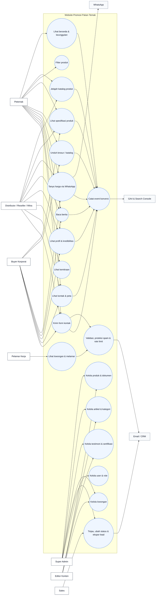
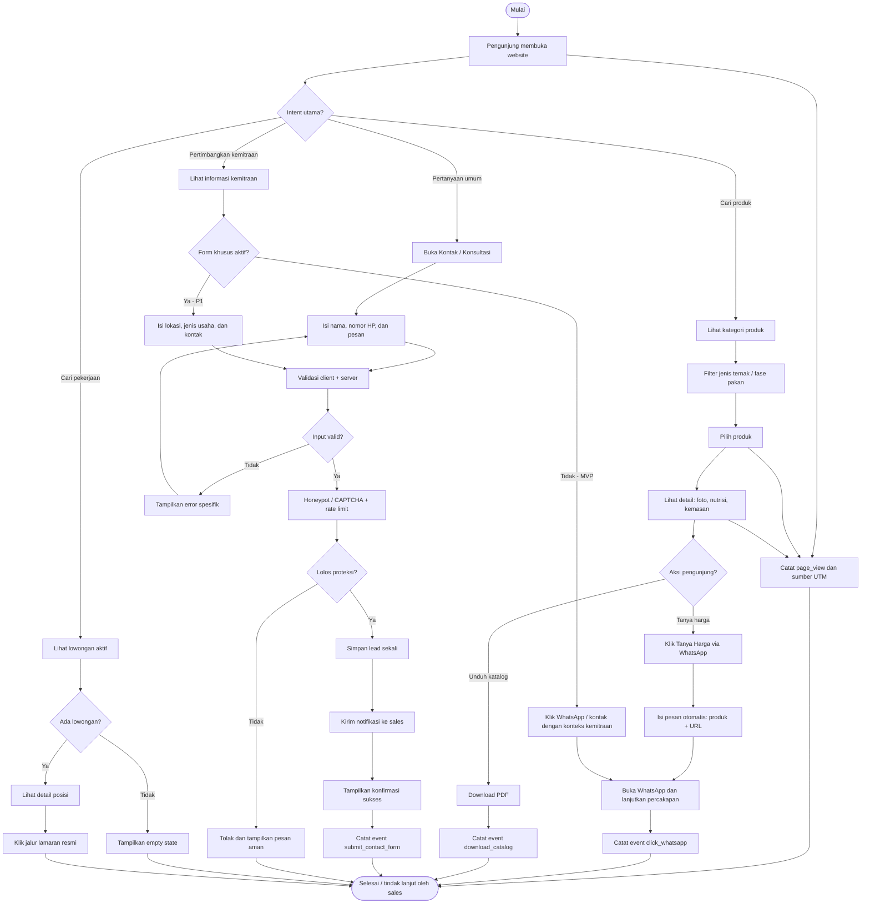
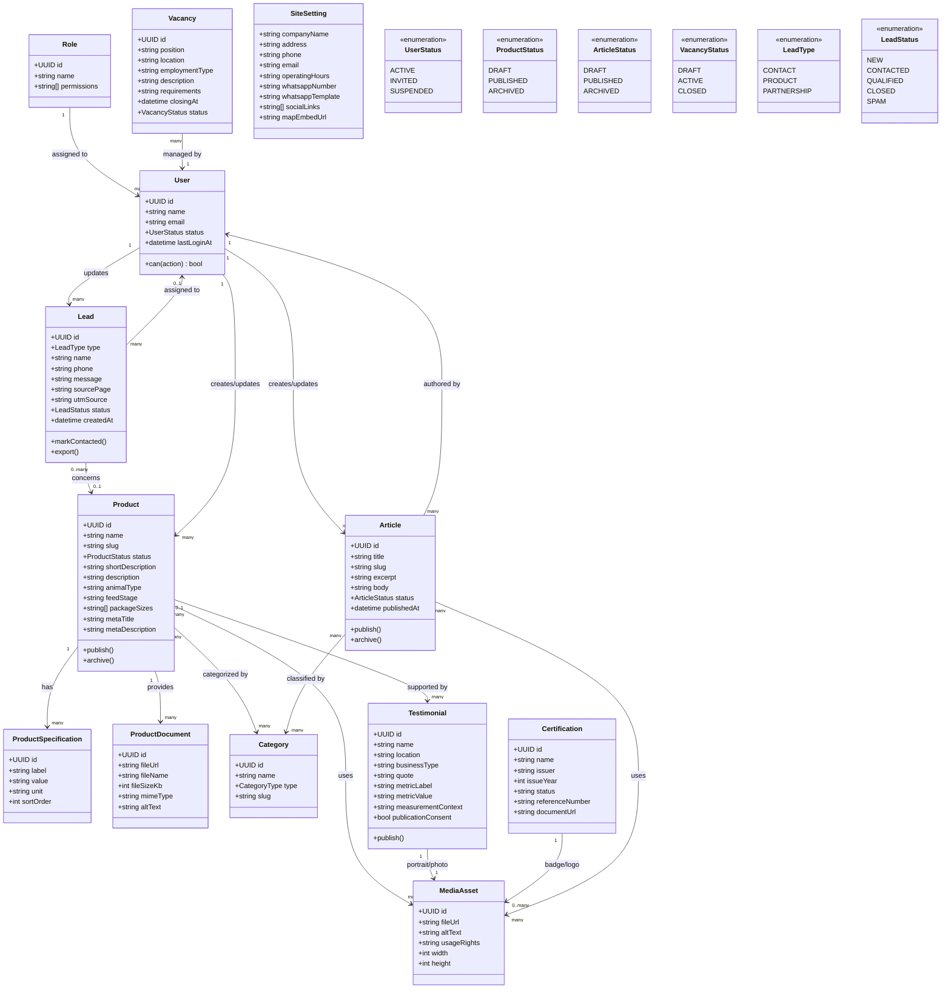

# Diagram Sistem Website Promosi Pakan Ternak

Dokumen ini melengkapi [PRD Website Promosi Pakan Ternak](./PRD_Website_Promosi_Pakan_Ternak.md). Diagram mengikuti scope MVP yang telah dinormalisasi: katalog dan detail produk, CTA WhatsApp, form lead, berita dasar, CMS, notifikasi, dan analytics. Form kemitraan lanjutan serta modul karir publik ditandai sebagai fase berikutnya.

## 1. Use Case Diagram

Diagram ini memperlihatkan aktor yang berinteraksi dengan website publik, CMS, serta layanan eksternal.

### Catatan use case

- `UC6` adalah konversi intent tinggi dan harus tersedia di detail produk serta sebagai tombol floating global.
- `UC19` dipakai oleh semua form yang menerima data pengunjung; upload CV mengikuti keputusan keamanan dan privasi fase berikutnya.
- `UC16` dapat disiapkan di CMS pada MVP, sedangkan halaman lowongan publik ditargetkan P1 sesuai keputusan pada PRD.
- Akses Editor dibatasi pada konten; pengelolaan user, role, dan pengaturan sensitif hanya untuk Super Admin.

## 2. Flowchart Alur Pengunjung dan Lead

Alur berikut memprioritaskan dua jalur konversi MVP: permintaan harga/konsultasi melalui WhatsApp dan pengiriman form kontak. Jalur kemitraan lanjutan diberi titik perluasan.

## 3. Class Diagram Domain dan CMS

Diagram ini menggambarkan entitas inti yang perlu didukung oleh CMS dan relasi data publik/operasional. Implementasi fisik dapat menggunakan tabel relasional, collection CMS, atau model yang ekuivalen.

### Aturan domain penting

- Hanya `PUBLISHED`, `ACTIVE`, dan status publik yang sesuai yang boleh tampil pada website.
- `Lead.phone`, `Lead.message`, dan dokumen lamaran tidak boleh dikirim ke analytics.
- `ProductSpecification` disimpan terstruktur agar dapat ditampilkan konsisten dan mudah dibandingkan di masa depan.
- `Category` dapat dipakai untuk jenis ternak maupun fase pakan, tetapi tipe kategorinya harus dibedakan agar filter tidak ambigu.
- `MediaAsset` menyimpan alt text dan hak penggunaan untuk mendukung aksesibilitas serta bukti legal aset.
- Relasi `Lead -> Product` bersifat opsional karena form kontak umum tidak selalu terkait produk tertentu.
